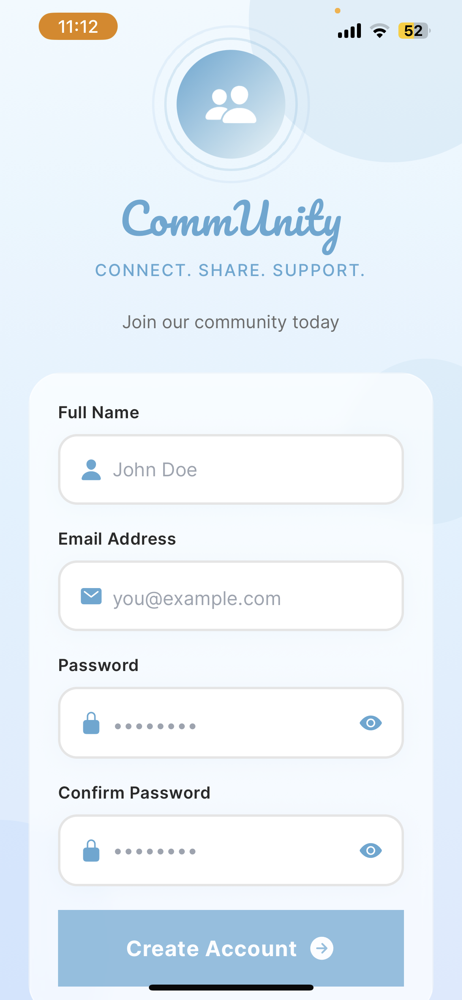
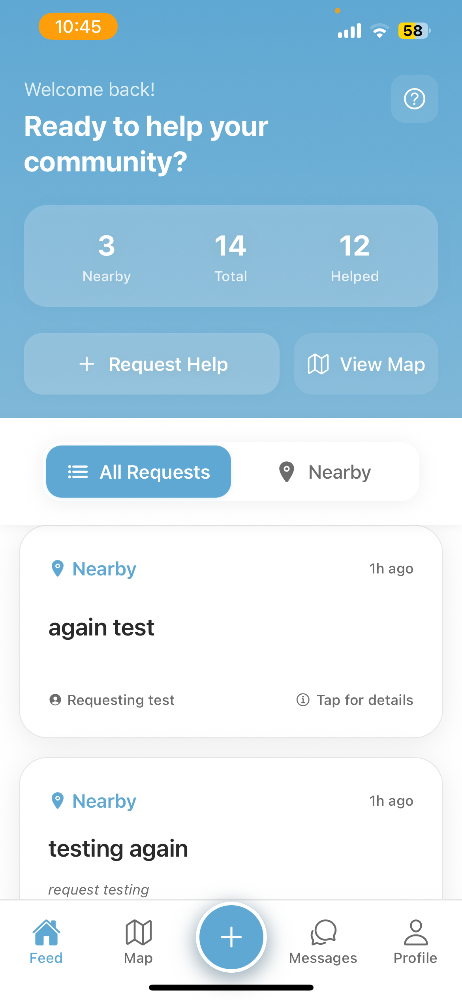
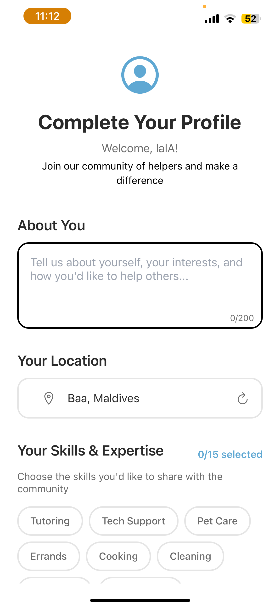
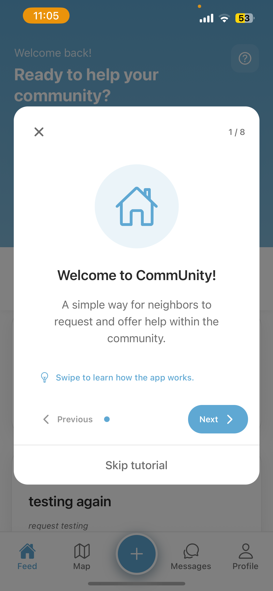
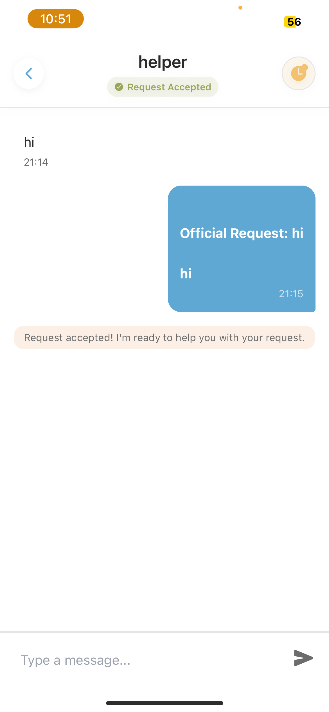
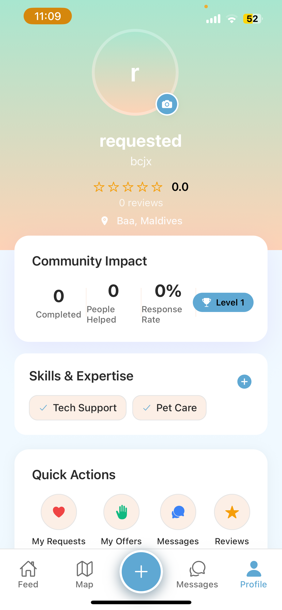
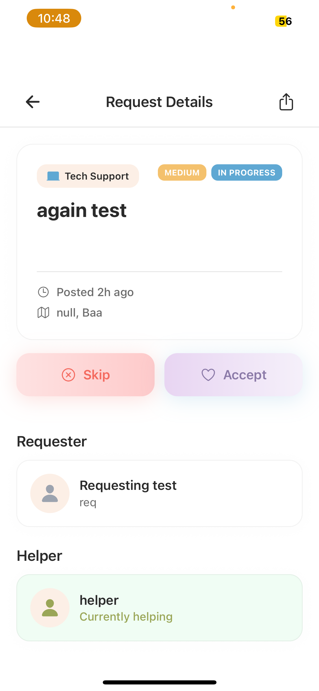
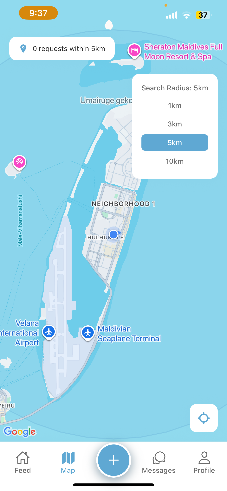
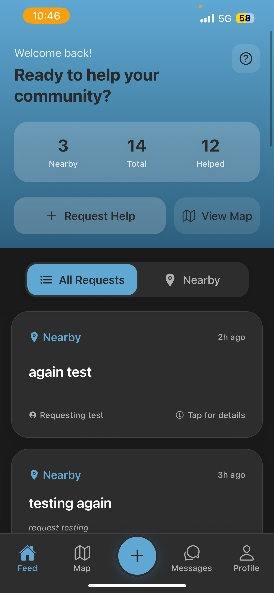

# CommUnity - Community Help & Support App

##  Project Title & Description

**CommUnity** is a mobile application designed to connect community members who need help with those who can offer assistance. Whether you need help with daily tasks, urgent matters, or specialized skills, CommUnity makes it easy to request and receive help from your local community.

The app features a comprehensive help request system with real-time chat, location-based services, user ratings, and a seamless interface for both requesting and offering help.

---

## Installation & Run Instructions

### Prerequisites
- Node.js (v18 or higher)
- npm or yarn
- Expo CLI
- Firebase project (for backend services)

### Setup Steps

1. **Clone the repository**
   ```bash
   git clone https://github.com/lyashahid/CommUnity.git
   ```

2. **Install dependencies**
   ```bash
   npm install
   ```


3. **Start the development server with expo**
   ```bash
   npx expo start
   ```

4. **Run on device/simulator**
   - Download Expo Go app on your mobile device
   - Scan the QR code from the terminal


## Feature List

### **Home & Feed**
- **Help Request Feed**: Browse available help requests in your area
- **Smart Filtering**: Automatic filtering of user's own requests and completed tasks
- **Swipe-to-Offer**: Quick gesture to offer help for requests
- **Location-based Sorting**: See requests nearest to you first
- **Real-time Updates**: Live status updates for all requests

###  **Chat System**
- **Real-time Messaging**: Instant communication between requesters and helpers
- **Official Requests**: Send formal help requests within chat
- **Accept/Reject Flow**: Clear workflow for pending requests
- **Status Indicators**: Visual indicators for request status
- **Message Types**: Support for system messages and official requests

### **Help Request Management**
- **Two Request Types**:
  - **Feed Requests**: Public requests visible to all users
  - **Official Chat Requests**: Private requests sent to specific users
- **Complete Status Flow**: `open → pending → ongoing → completed`
- **Permission Controls**: Role-based access for different actions
- **Rating System**: Rate helpers after completed requests

### **User Profiles**
- **Profile Management**: Edit personal information and skills
- **Photo Upload**: Custom profile pictures with Firebase Storage
- **Reviews & Ratings**: View user's help history and ratings
- **Statistics**: Track help offered and received

### **Location Services**
- **Map View**: Visual representation of help requests on map
- **Geolocation**: Automatic location detection for requests
- **Distance Calculation**: Show distance to help requests
- **Location Privacy**: User-controlled location sharing

### **User Experience**
- **Onboarding Flow**: Guided introduction for new users
- **Authentication**: Secure login/signup with Firebase Auth
- **Beautiful UI**: Modern, intuitive interface with smooth animations
- **Push Notifications**: Real-time updates for request status changes

## Screenshots

### Main Screens

#### Home Feed Screen
*Browse and swipe through help requests in your area*
- Scrollable feed with request cards
- Category and urgency badges
- Distance indicators
- Swipe gestures for quick actions

#### Map Screen
*Visual overview of help requests in your vicinity*
- Interactive map with request pins
- Clustered markers for multiple requests
- Location-based filtering

#### Chat & Messages
*Communicate with other community members*
- Message list with conversation previews
- Real-time chat interface
- Official request buttons
- Accept/reject pending requests

#### Profile Management
*Manage your personal information and view your history*
- Profile picture and personal details
- My Requests section (ongoing/completed)
- My Offers section (active/completed)
- Reviews and ratings from others

#### Authentication Flow
*Secure login and onboarding experience*
- Welcome screen with app introduction
- Login and signup forms
- Onboarding flow for new users
- Profile setup wizard

#### Create Help Request
*Easily create new help requests*
- Category selection
- Urgency levels
- Location picker

## Technologies Used

### Frontend Framework
- **React Native** (v0.81.5) - Cross-platform mobile development
- **Expo** (v54.0.20) - Development platform and tooling
- **TypeScript** - Type-safe JavaScript development

### Navigation & UI
- **React Navigation** (v7.x) - Screen navigation and routing
  - Stack Navigator
  - Bottom Tabs Navigator
- **React Native Gesture Handler** - Touch and gesture handling
- **React Native Screens** - Optimized native screens
- **React Native Safe Area Context** - Safe area handling

### Firebase Services
- **@react-native-firebase/app** (v23.5.0) - Firebase core
- **@react-native-firebase/auth** - Authentication
- **@react-native-firebase/firestore** - Real-time database
- **Firebase** (v12.6.0) - Web Firebase SDK

### UI Components & Styling
- **Expo Vector Icons** - Icon library
- **Expo Linear Gradient** - Gradient backgrounds
- **Expo Blur** - Blur effects
- **Lottie React Native** - Animations
- **React Native Maps** (v1.20.1) - Map integration
- **React Native Swipe List View** - Swipeable list items

### Device Features
- **Expo Image Picker** - Camera and photo library access
- **Expo Location** - GPS and location services
- **Expo Notifications** - Push notifications
- **React Native Async Storage** - Local data persistence
- **React Native Geolocation** - Advanced location services

### Development Tools
- **TypeScript** (v5.9.2) - Static type checking
- **Babel** - JavaScript transpilation
- **Metro** - React Native bundler

## Known Issues & Future Improvements

### Known Issues
- **Firebase Storage Setup**: Requires manual configuration in Firebase Console
- **Location Permissions**: May need manual permission grants on some devices
- **Network Connectivity**: Real-time features require stable internet connection
- **iOS Simulator**: Some features like camera may not work in simulator

#### **UI/UX Improvements**
- **Dark Mode**: Support for system dark mode
- **Custom Themes**: Personalized color schemes
- **Accessibility**: Enhanced accessibility features
- **Internationalization**: Multi-language support
- **Better Animations**: Smoother transitions and micro-interactions

#### **Technical Improvements**
- **Performance Optimization**: Improve app startup and response times
- **Caching Strategy**: Better data caching for offline use
- **Error Handling**: More robust error recovery
- **Testing Suite**: Comprehensive unit and integration tests
- **Code Splitting**: Reduce initial bundle size

####  **Platform Features**
- **Web Version**: Desktop web application
- **Admin Dashboard**: Management interface for moderators
- **Analytics Integration**: User behavior analytics
- **API Documentation**: Public API for third-party integrations
- **Community Guidelines**: Built-in moderation and reporting system

#### **Social Features**
- **Social Connections**: Friend/follower system
- **Group Help**: Community group requests
- **Skill Badges**: Verified skill certifications
- **Leaderboards**: Top helpers recognition
- **Events**: Community help events and meetups


## Screenshots

<table>
  <tr>
    <td align="center">
      
      <br/>
      <strong>Login</strong>
    </td>
    <td align="center">
      
      <br/>
      <strong>Signup</strong>
    </td>
    <td align="center">
      
      <br/>
      <strong>Home Feed</strong>
    </td>
    <td align="center">
      
      <br/>
      <strong>Onboarding</strong>
    </td>
    <td align="center">
      
      <br/>
      <strong>Instructions</strong>
    </td>
    <td align="center">
      
      <br/>
      <strong>Instructions</strong>
    </td>
  </tr>
  <tr>
    <td align="center">
      
      <br />
      <strong>Chat</strong>
    </td>
    <td align="center">
      
      <br />
      <strong>Profile</strong>
    </td>
    <td align="center">
      
      <br/>
      <strong>Request Details</strong>
    </td>
    <td align="center">
      
      <br/>
      <strong>Map View</strong>
    </td>
    <td align="center">
      
      <br/>
      <strong>Dark Mode</strong>
    </td>
  </tr>
</table>
